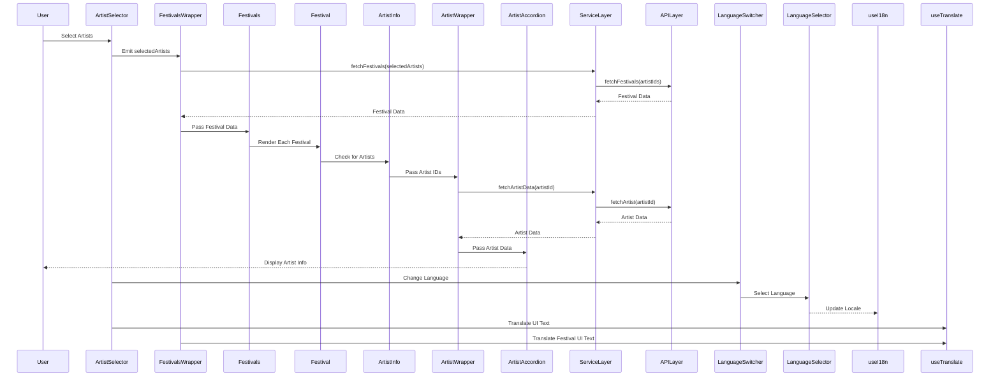

# Sequence Diagram

```mermaid
sequenceDiagram
   participant User
    participant ArtistSelector
    participant FestivalsWrapper
    participant Festivals
    participant Festival
    participant ArtistInfo
    participant ArtistWrapper
    participant ArtistAccordion
    participant ServiceLayer
    participant APILayer

    User->>ArtistSelector: Select Artists
    ArtistSelector->>FestivalsWrapper: Emit selectedArtists
    FestivalsWrapper->>ServiceLayer: fetchFestivals(selectedArtists)
    ServiceLayer->>APILayer: fetchFestivals(artistIds)
    APILayer-->>ServiceLayer: Festival Data
    ServiceLayer-->>FestivalsWrapper: Festival Data
    FestivalsWrapper->>Festivals: Pass Festival Data
    Festivals->>Festival: Render Each Festival
    Festival->>ArtistInfo: Check for Artists
    ArtistInfo->>ArtistWrapper: Pass Artist IDs
    ArtistWrapper->>ServiceLayer: fetchArtistData(artistId)
    ServiceLayer->>APILayer: fetchArtist(artistId)
    APILayer-->>ServiceLayer: Artist Data
    ServiceLayer-->>ArtistWrapper: Artist Data
    ArtistWrapper->>ArtistAccordion: Pass Artist Data
    ArtistAccordion-->>User: Display Artist Info
    ArtistSelector->>LanguageSwitcher: Change Language
    LanguageSwitcher->>LanguageSelector: Select Language
    LanguageSelector-->>useI18n: Update Locale
    ArtistSelector->>useTranslate: Translate UI Text
    FestivalsWrapper->>useTranslate: Translate Festival UI Text
```
